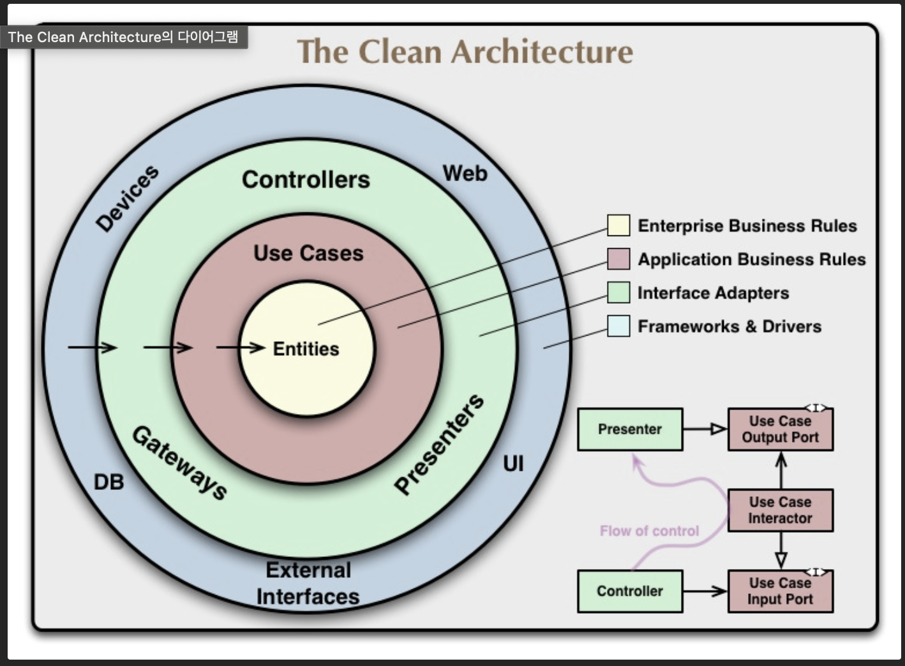

# 28장 테스트 경계
아키텍처를 설계할때 테스트도 고려해서 설계해야 한다.

시스템에 강하게 결합되어 있는 테스트라면 시스템이 변경될 때 함께 변경되어야 한다. 변동성이 있는 것에 의존하지 않게 잘 설계해야 한다.

테스트는 태생적으로 의존성 규칙을 따른다. 테스트는 세부적이며 구체적인 것으로 의존성은 항상 테스트 대상이 되는 코드를 향한다. (아키텍처에서 테스트는 가장 바깥쪽 원이다.)

