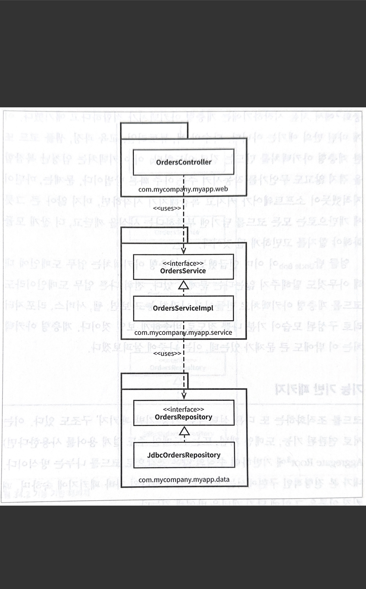
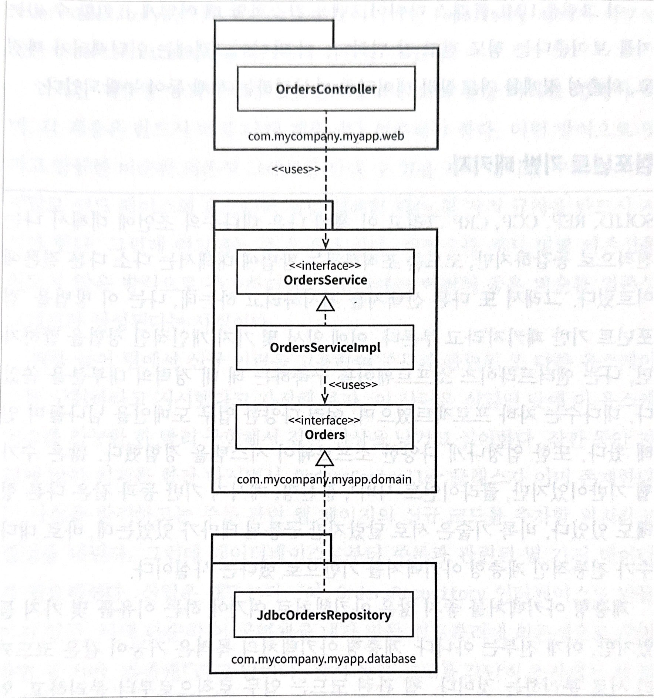
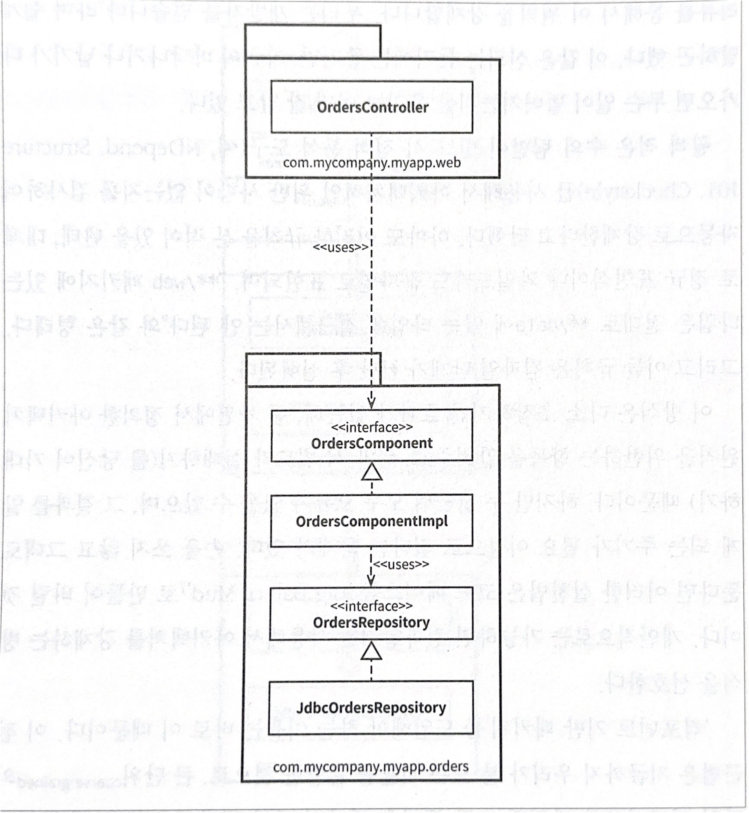

# 34장 빠져 있는 장

- OrdersController: 웹 컨트롤러
- OrdersService: 주문과 관련된 '업무 규칙'을 정의하는 인터페이스
- OrdersServiceImpl: OrdersService의 구현체
- OrdersRepository: 영구 저장된 주문 정보에 접근하는 방법을 정의하는 인터페이스
- JdbcOrdersRepository: OrdersRepository 인터페이스의 구현체

## 계층 기반 패키지 (수평 계층형 아키텍처)

## 기능 기반 패키지

기능을 기반으로 공통된 기능끼리 한 패키지에 담겨있다. 이미지에서는 orders 라는 패키지에 해당 코드가 다 담겨있다.

## 도메인 기반 패키지

내부와 외부로 나누었다. 외부(web 패키지, database 패키지)가 내부(domain 패키지) 방향으로 의존성이 흐른다.

## 컴포넌트 기반 패키지

업무 로직과 영속성 관련 코드를 하나로 묶었다. (컴포넌트화)
주문(Order)과 관련된 무언가를 개발해야할 때, OrdersComponent만 둘러보면 된다는 이점이 있다. 

컴포넌트 내부에서 관심사의 분리는 여전히 유효하며, 업무 로직은 데이터 영속성과 분리되어 있다.

모든 타입에서 public 을 사용하지 말자. 과도하게 public을 사용하면 캡슐화와 은닉과 관련된 이점을 활용하지 않겠다는 뜻이다. 